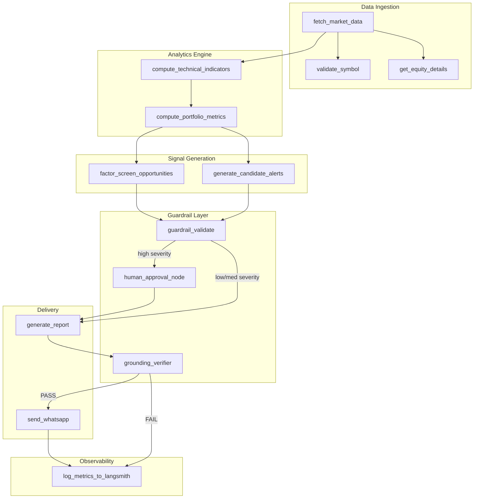
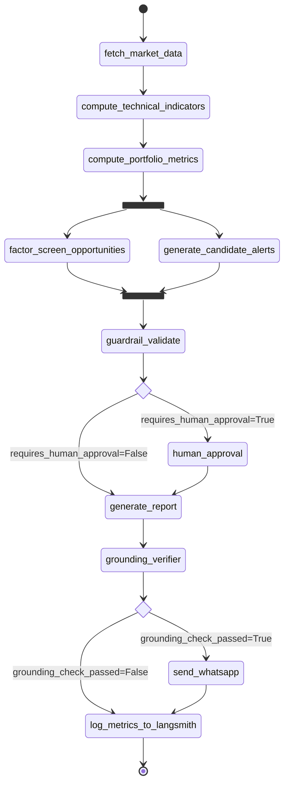

# ARCHITECTURE.md — Agentic Stock Portfolio Analyst & Alert System

> **Audience**: Senior engineers, technical interviewers, code reviewers.
> **Scope**: Every component, formula, guardrail, and data path — with actual code from the repo.
> **Policy**: If something isn't implemented, it says so. No fabricated metrics.

---

## Table of Contents

1. [System Overview](#1-system-overview)
2. [Tech Stack Breakdown](#2-tech-stack-breakdown)
3. [LangGraph Node-by-Node Breakdown](#3-langgraph-node-by-node-breakdown)
4. [Market Parameters & Analytics — Full Formulas](#4-market-parameters--analytics--full-formulas)
5. [Guardrail Layer — Deep Dive](#5-guardrail-layer--deep-dive)
6. [Grounding Accuracy Methodology](#6-grounding-accuracy-methodology)
7. [Observability with LangSmith](#7-observability-with-langsmith)
8. [Data Flow Example — End-to-End Trace](#8-data-flow-example--end-to-end-trace)
9. [Failure Handling & Edge Cases](#9-failure-handling--edge-cases)
10. [Deployment & Ops](#10-deployment--ops)

---

## 1. System Overview

### Problem

Retail investors holding NSE portfolios need:
- Real-time technical signal detection (RSI extremes, MACD crossovers, Bollinger breakouts)
- Portfolio-level risk monitoring (concentration, drawdown, VaR breaches)
- Factor-screened opportunity identification (momentum, quality, low-volatility)
- Delivery of grounded, compliance-disclaimed alerts via WhatsApp

A simple cron+script pipeline can compute indicators, but it cannot:
1. **Contextually synthesize** signals across multiple holdings and explain them in natural language
2. **Route conditionally** — high-severity alerts need human approval; low-severity ones don't
3. **Self-verify** — every number in the generated report must trace to a deterministic tool output, not LLM hallucination
4. **Interrupt and resume** — a human-in-the-loop gate must pause the pipeline and resume after approval

These requirements demand a **state machine** with conditional edges, parallel fan-out, and checkpoint-based interrupts — which is exactly what LangGraph provides.

### High-Level Architecture



---

## 2. Tech Stack Breakdown

### Python 3.12

Key libraries and their roles:

| Library | Version | Role |
|---------|---------|------|
| `pandas` | ≥2.0 | OHLCV data manipulation, rolling windows, returns computation |
| `numpy` | ≥1.24 | Vectorized math: Sharpe, VaR percentile, drawdown |
| `yfinance` | ≥0.2.40 | Primary data vendor for NSE prices (`.NS` suffix) |
| `pandas-ta` | ≥0.3.14b | RSI, MACD, Bollinger Bands (with manual fallbacks) |
| `scipy` | ≥1.10 | Statistical distributions (planned: parametric VaR) |
| `matplotlib` + `seaborn` | ≥3.7 | Backtest equity curve charts |

### LangGraph (≥0.2.0)

**Why a graph, not a chain?**

The pipeline has three properties that break linear chains:
1. **Fan-out**: After `compute_portfolio_metrics`, two nodes run in parallel (`factor_screen_opportunities` + `generate_candidate_alerts`), both writing to the same state. This requires `Annotated` reducers.
2. **Conditional edges**: After `guardrail_validate`, the graph branches based on `requires_human_approval`. After `grounding_verifier`, it branches based on `grounding_check_passed`.
3. **Interrupt**: The `human_approval` node uses LangGraph's `interrupt()` to pause execution and wait for an external signal.

A linear chain cannot express fan-out + fan-in, conditional routing, or checkpoint-based interrupts.

### LangSmith (≥0.3.45)

What is traced (from `log_metrics_to_langsmith`):
- Per-run: Sharpe ratio, volatility, VaR, drawdown
- Alert pipeline: candidate count, validated count, blocked count, catch rate
- Grounding: pass/fail flag, unverified claim list
- Delivery: Twilio status, message length, session window state
- Errors: first 10 errors from the run

### MCP Server (Python, stdio)

The MCP server is defined in `mcp_server/server.py` and exposes **9 tools**:

```python
app = Server("nse-stock-analyst")

@app.list_tools()
async def list_tools() -> list[Tool]:
    return [
        Tool(name="get_equity_details", ...),
        Tool(name="get_equity_historical_data", ...),
        Tool(name="get_all_stock_symbols", ...),
        Tool(name="get_indices", ...),
        Tool(name="validate_symbol", ...),
        Tool(name="compute_technical_indicators", ...),
        Tool(name="compute_portfolio_metrics", ...),
        Tool(name="factor_screen", ...),
        Tool(name="backtest_alert_rule", ...),
    ]
```

Each tool wraps a pure-Python async function. No TypeScript, no Node.js. Data flows through `yfinance` (Yahoo Finance API with `.NS` suffix for NSE stocks).

**Tool → Data Source Mapping:**

| MCP Tool | Underlying Function | Data Source |
|----------|-------------------|-------------|
| `validate_symbol` | `get_all_stock_symbols()` → cached set lookup | Hardcoded top-100 NSE symbols |
| `get_equity_details` | `yf.Ticker(symbol).info` + `.history(period="5d")` | Yahoo Finance |
| `get_equity_historical_data` | `yf.Ticker(symbol).history(start, end)` | Yahoo Finance |
| `get_indices` | `yf.Ticker("^NSEI").history(period="2d")` | Yahoo Finance |
| `compute_technical_indicators` | `pandas-ta` or manual RSI/MACD/BB | Derived from Yahoo Finance OHLCV |
| `compute_portfolio_metrics` | `yf.download()` batch + numpy math | Yahoo Finance |
| `factor_screen` | `yf.download()` batch + factor scoring | Yahoo Finance |
| `backtest_alert_rule` | `yf.Ticker().history()` + signal replay | Yahoo Finance |

### PostgreSQL

**Current state**: The `requirements.txt` includes `psycopg2-binary>=2.9.0` and `config.py` defines `POSTGRES_CONNECTION_STRING`, but **no Postgres schema is implemented yet**. The LangGraph checkpointer uses `MemorySaver` (in-memory). Postgres integration is planned for production state persistence.

### WhatsApp Business API (Twilio)

Delivery is handled via the Twilio WhatsApp API in `send_whatsapp.py`:
- **Session window check**: If the user messaged within 24 hours, freeform text is sent. Otherwise, a pre-approved template is used (WhatsApp policy compliance).
- **Truncation**: Reports exceeding 4096 chars are truncated while preserving the regulatory disclaimer.
- **Mock mode**: If `WHATSAPP_TO` is not configured, delivery runs in mock mode without sending.

### NSE India Data Access

**No direct NSE API is used.** All market data comes through `yfinance`, which scrapes Yahoo Finance. NSE symbol mapping is maintained via a hardcoded dictionary in `market_data.py`:

```python
NSE_SECTOR_MAP: dict[str, str] = {
    "RELIANCE": "Energy", "TCS": "Technology", "HDFCBANK": "Banking",
    "INFY": "Technology", "ICICIBANK": "Banking", "HINDUNILVR": "FMCG",
    "SBIN": "Banking", "BHARTIARTL": "Telecom", "ITC": "FMCG",
    # ... 40+ entries
}
```

The symbol universe (`get_all_stock_symbols`) returns ~100 symbols (top NSE equities by market cap). This is **not** a live NSE API call — it's a cached list.

---

## 3. LangGraph Node-by-Node Breakdown

### State Schema

Every node reads from and writes to `PortfolioState`. This is the **single source of truth** for the entire graph. The full definition from `agent/state.py`:

```python
def _merge_dicts(a: dict, b: dict) -> dict:
    """Reducer for dict keys written by concurrent nodes."""
    return {**a, **b}

def _concat_lists(a: list, b: list) -> list:
    """Reducer for list keys written by concurrent nodes."""
    return a + b

class Holding(TypedDict):
    symbol: str
    quantity: float
    avg_price: float

class Alert(TypedDict):
    symbol: str
    alert_type: Literal["price_move", "technical_signal", "portfolio_risk", "new_opportunity"]
    severity: Literal["low", "medium", "high"]
    grounded_facts: dict           # every number MUST map to a tool_call_id
    rationale: str
    source_tool_calls: list[str]   # list of tool_call_ids backing each claim

class PortfolioState(TypedDict):
    # Input
    portfolio: list[Holding]
    trigger_type: Literal["scheduled_scan", "portfolio_update", "manual_query"]

    # Market data layer
    raw_market_data: dict
    technical_indicators: dict
    portfolio_metrics: dict

    # Screening (concurrent node — needs reducer)
    screened_opportunities: Annotated[list[dict], _concat_lists]

    # Alert pipeline (concurrent node — needs reducer)
    candidate_alerts: Annotated[list[Alert], _concat_lists]
    validated_alerts: list[Alert]
    blocked_alerts: list[dict]

    # Control flow
    requires_human_approval: bool
    human_approved: Optional[bool]

    # Report generation
    report_draft: str
    grounding_check_passed: bool
    grounding_failures: list[str]

    # Delivery
    delivery_status: dict

    # Observability (concurrent — needs reducer)
    tool_call_registry: Annotated[dict[str, Any], _merge_dicts]
    errors: Annotated[list[str], operator.add]
```

**Why `Annotated` reducers?** When `factor_screen_opportunities` and `generate_candidate_alerts` run in parallel and both write to `candidate_alerts`, LangGraph needs to know how to merge their outputs. Without `_concat_lists`, the second write would overwrite the first, causing an `InvalidUpdateError`. Similarly, `tool_call_registry` uses `_merge_dicts` because every node registers its tool calls.

---

### Node 1: `fetch_market_data`

**File**: `agent/nodes/fetch_market_data.py`
**Responsibility**: Validate every portfolio symbol against NSE listings, then fetch live equity details.
**Inbound edge**: Entry point (graph start)
**Outbound edge**: → `compute_technical_indicators`

```python
async def fetch_market_data(state: PortfolioState) -> dict:
    portfolio = state.get("portfolio", [])
    raw_market_data = {}
    tool_call_registry = dict(state.get("tool_call_registry", {}))
    errors = []

    for holding in portfolio:
        symbol = holding["symbol"].upper()

        # --- Guardrail 5.1: Symbol validation MUST run first ---
        validation_id = f"validate_{symbol}_{uuid.uuid4().hex[:8]}"
        try:
            validation = await validate_symbol(symbol)
            tool_call_registry[validation_id] = {
                "tool": "validate_symbol",
                "args": {"symbol": symbol},
                "output": validation,
                "timestamp": datetime.now().isoformat(),
            }
            if not validation["valid"]:
                errors.append(f"Symbol '{symbol}' failed validation: {validation['message']}")
                continue
        except Exception as e:
            errors.append(f"Symbol validation error for '{symbol}': {str(e)}")
            continue

        # --- Fetch equity details ---
        equity_id = f"equity_{symbol}_{uuid.uuid4().hex[:8]}"
        try:
            equity_data = await get_equity_details(symbol)
            tool_call_registry[equity_id] = {
                "tool": "get_equity_details",
                "args": {"symbol": symbol},
                "output": equity_data,
                "timestamp": datetime.now().isoformat(),
            }
            raw_market_data[symbol] = {
                "equity_details": equity_data,
                "equity_tool_call_id": equity_id,
                "validation_tool_call_id": validation_id,
            }
        except Exception as e:
            errors.append(f"Failed to fetch equity data for '{symbol}': {str(e)}")

    return {
        "raw_market_data": raw_market_data,
        "tool_call_registry": tool_call_registry,
        "errors": errors,
    }
```

**Failure mode**: If `validate_symbol` or `get_equity_details` throws, the symbol is skipped and the error is appended to `errors`. Downstream nodes operate only on symbols present in `raw_market_data`.

**Key design detail**: Every tool call is registered in `tool_call_registry` with a unique ID (`validate_TCS_a1b2c3d4`). This ID is the audit trail — the grounding verifier later checks that every number in the report traces back to one of these registered outputs.

---

### Node 2: `compute_technical_indicators`

**File**: `agent/nodes/compute_technical_indicators.py`
**Responsibility**: Compute RSI(14), MACD(12,26,9), SMA(50), SMA(200), Bollinger Bands(20,2), EMA(20), Volume analysis for each symbol.
**Inbound edge**: ← `fetch_market_data`
**Outbound edge**: → `compute_portfolio_metrics`

```python
async def compute_technical_indicators_node(state: PortfolioState) -> dict:
    raw_market_data = state.get("raw_market_data", {})
    tool_call_registry = dict(state.get("tool_call_registry", {}))
    technical_indicators = {}
    errors = []

    for symbol in raw_market_data:
        call_id = f"tech_indicators_{symbol}_{uuid.uuid4().hex[:8]}"
        try:
            result = await _compute(symbol, indicators=["ALL"], period_days=365)
            tool_call_registry[call_id] = {
                "tool": "compute_technical_indicators",
                "args": {"symbol": symbol, "indicators": ["ALL"]},
                "output": result,
                "timestamp": datetime.now().isoformat(),
            }
            technical_indicators[symbol] = {**result, "tool_call_id": call_id}
        except Exception as e:
            errors.append(f"Technical indicator computation failed for '{symbol}': {str(e)}")

    return {
        "technical_indicators": technical_indicators,
        "tool_call_registry": tool_call_registry,
        "errors": errors,
    }
```

The underlying `compute_technical_indicators` function in `mcp_server/tools/technical_indicators.py` supports both `pandas-ta` and manual fallback implementations:

```python
# RSI manual fallback
def _manual_rsi(close: pd.Series, period: int = 14) -> float:
    delta = close.diff()
    gain = delta.clip(lower=0).rolling(period).mean()
    loss = (-delta.clip(upper=0)).rolling(period).mean()
    rs = gain / loss.replace(0, np.nan)
    rsi = 100 - (100 / (1 + rs))
    return float(rsi.iloc[-1]) if not rsi.empty else None

# MACD manual implementation
def _manual_macd(close: pd.Series) -> dict:
    ema12 = close.ewm(span=12, adjust=False).mean()
    ema26 = close.ewm(span=26, adjust=False).mean()
    macd_line = ema12 - ema26
    signal_line = macd_line.ewm(span=9, adjust=False).mean()
    histogram = macd_line - signal_line
    return {
        "macd": float(macd_line.iloc[-1]),
        "signal": float(signal_line.iloc[-1]),
        "histogram": float(histogram.iloc[-1]),
    }

# Bollinger Bands manual implementation
def _manual_bollinger(close: pd.Series, period: int = 20, std_dev: float = 2.0) -> dict:
    sma = close.rolling(period).mean()
    std = close.rolling(period).std()
    upper = sma + std_dev * std
    lower = sma - std_dev * std
    return {
        "upper": float(upper.iloc[-1]),
        "middle": float(sma.iloc[-1]),
        "lower": float(lower.iloc[-1]),
        "bandwidth": float(((upper - lower) / sma).iloc[-1]),
        "percent_b": float(((close - lower) / (upper - lower)).iloc[-1]),
    }
```

---

### Node 3: `compute_portfolio_metrics`

**File**: `agent/nodes/compute_portfolio_metrics.py`
**Responsibility**: Calculate Sharpe ratio, annualized volatility, max drawdown, VaR(95%), sector exposure, and severity flags.
**Inbound edge**: ← `compute_technical_indicators`
**Outbound edges**: → `factor_screen_opportunities` AND → `generate_candidate_alerts` (parallel fan-out)

```python
async def compute_portfolio_metrics_node(state: PortfolioState) -> dict:
    portfolio = state.get("portfolio", [])
    raw_market_data = state.get("raw_market_data", {})
    tool_call_registry = dict(state.get("tool_call_registry", {}))
    errors = []

    validated_holdings = [h for h in portfolio if h["symbol"].upper() in raw_market_data]
    if not validated_holdings:
        return {
            "portfolio_metrics": {"error": "No validated holdings to compute metrics for"},
            "errors": ["No validated holdings available for portfolio metrics"],
        }

    call_id = f"portfolio_metrics_{uuid.uuid4().hex[:8]}"
    try:
        metrics = await _compute_metrics(validated_holdings, period_days=365)
        tool_call_registry[call_id] = {
            "tool": "compute_portfolio_metrics",
            "args": {"holdings": validated_holdings},
            "output": metrics,
            "timestamp": datetime.now().isoformat(),
        }
        metrics["tool_call_id"] = call_id
    except Exception as e:
        errors.append(f"Portfolio metrics computation failed: {str(e)}")
        metrics = {"error": str(e)}

    return {
        "portfolio_metrics": metrics,
        "tool_call_registry": tool_call_registry,
        "errors": errors,
    }
```

The underlying math is in `mcp_server/tools/portfolio_metrics.py` — see Section 4 for full formulas.

---

### Node 4: `factor_screen_opportunities`

**File**: `agent/nodes/factor_screen_opportunities.py`
**Responsibility**: Run quantitative factor screen (momentum + quality + low_volatility), then use LLM **only to explain** why each candidate passed — never to pick stocks.
**Inbound edge**: ← `compute_portfolio_metrics` (parallel with Node 5)
**Outbound edge**: → `guardrail_validate` (fan-in with Node 5)

```python
async def factor_screen_opportunities(state: PortfolioState) -> dict:
    tool_call_registry = dict(state.get("tool_call_registry", {}))
    errors = []

    call_id = f"factor_screen_{uuid.uuid4().hex[:8]}"
    try:
        screen_result = await _factor_screen(
            universe=[],  # full default universe
            factors=["momentum", "quality", "low_volatility"],
            top_n=10,
        )
        tool_call_registry[call_id] = {
            "tool": "factor_screen",
            "args": {"factors": ["momentum", "quality", "low_volatility"]},
            "output": screen_result,
            "timestamp": datetime.now().isoformat(),
        }

        candidates = screen_result.get("candidates", [])

        # LLM explains each candidate — does NOT invent new ones
        enriched_candidates = []
        if candidates:
            for cand in candidates[:5]:  # top 5 for LLM explanation
                prompt = (
                    f"Symbol: {cand['symbol']}\n"
                    f"Sector: {cand['sector']}\n"
                    f"Composite Score: {cand['composite_score']}\n"
                    f"Factor Scores: {cand['factor_scores']}\n\n"
                    "Explain in 2-3 sentences why this stock passed the quantitative "
                    "factor screen. Do NOT make price predictions."
                )
                try:
                    response = await llm.ainvoke([
                        SystemMessage(content=FACTOR_SCREENING_PROMPT),
                        HumanMessage(content=prompt),
                    ])
                    explanation = response.content
                except Exception as llm_err:
                    explanation = f"LLM explanation unavailable: {llm_err}"

                enriched_candidates.append({
                    **cand,
                    "explanation": explanation,
                    "source_tool_call_id": call_id,
                })

        return {
            "screened_opportunities": enriched_candidates,
            "tool_call_registry": tool_call_registry,
            "errors": errors,
        }
    except Exception as e:
        errors.append(f"Factor screening failed: {str(e)}")
        return {
            "screened_opportunities": [],
            "tool_call_registry": tool_call_registry,
            "errors": errors,
        }
```

**Critical design**: The LLM (Groq Llama 3.3 70B, temperature=0.1) is given **only tool output data** and asked to explain it. The candidates themselves come from `factor_screen` — a pure-math function. This separation ensures that stock picks are deterministic and reproducible.

---

### Node 5: `generate_candidate_alerts`

**File**: `agent/nodes/generate_candidate_alerts.py`
**Responsibility**: Scan raw market data, technical indicators, and portfolio metrics for alert conditions. Generate structured `Alert` objects with `source_tool_calls` for grounding.
**Inbound edge**: ← `compute_portfolio_metrics` (parallel with Node 4)
**Outbound edge**: → `guardrail_validate` (fan-in with Node 4)

Three alert types are generated:

**Alert Type 1: Price Moves (≥3%)**
```python
for symbol, data in raw_market_data.items():
    equity = data.get("equity_details", {})
    change_pct = equity.get("change_pct")
    if change_pct is None:
        continue
    if abs(change_pct) >= 3.0:
        severity = _determine_severity("price_move", symbol, {"change_pct": change_pct}, portfolio_metrics)
        alert: Alert = {
            "symbol": symbol,
            "alert_type": "price_move",
            "severity": severity,
            "grounded_facts": {
                "current_price": equity.get("current_price"),
                "previous_close": equity.get("previous_close"),
                "change_pct": change_pct,
            },
            "rationale": f"{symbol} moved {change_pct:+.2f}% today ...",
            "source_tool_calls": [data.get("equity_tool_call_id", "unknown")],
        }
        candidate_alerts.append(alert)
```

**Alert Type 2: Technical Signals (RSI >70 or <30, MACD divergence)**
```python
for symbol, ind_data in technical_indicators.items():
    indicators = ind_data.get("indicators", {})
    tool_call_id = ind_data.get("tool_call_id", "unknown")
    rsi_data = indicators.get("RSI", {})
    rsi_val = rsi_data.get("value")

    if rsi_val is not None and (rsi_val > 70 or rsi_val < 30):
        severity = _determine_severity("technical_signal", symbol, {"rsi": rsi_val}, portfolio_metrics)
        label = "overbought" if rsi_val > 70 else "oversold"
        alert = {
            "symbol": symbol,
            "alert_type": "technical_signal",
            "severity": severity,
            "grounded_facts": {"rsi": rsi_val, "current_price": current_price},
            "rationale": f"{symbol} RSI at {rsi_val:.1f} — {label}.",
            "source_tool_calls": [tool_call_id],
        }
        candidate_alerts.append(alert)
```

**Alert Type 3: Portfolio Risk Breaches**
```python
severity_flags = portfolio_metrics.get("severity_flags", [])
if severity_flags:
    pm_tool_call_id = portfolio_metrics.get("tool_call_id", "unknown")
    metrics = portfolio_metrics.get("metrics", {})
    alert = {
        "symbol": "PORTFOLIO",
        "alert_type": "portfolio_risk",
        "severity": "high" if portfolio_metrics.get("requires_high_severity") else "medium",
        "grounded_facts": {
            "sharpe_ratio": metrics.get("sharpe_ratio"),
            "annualized_volatility_pct": metrics.get("annualized_volatility_pct"),
            "max_drawdown_pct": metrics.get("max_drawdown_pct"),
            "var_95_pct": metrics.get("var_95_pct"),
            "sector_exposure": portfolio_metrics.get("sector_exposure", {}),
        },
        "rationale": "Portfolio risk breach: " + "; ".join(severity_flags),
        "source_tool_calls": [pm_tool_call_id],
    }
    candidate_alerts.append(alert)
```

**Severity determination** is threshold-based, never LLM-judged:

```python
def _determine_severity(alert_type, symbol, data, portfolio_metrics):
    if alert_type == "price_move":
        change_pct = abs(data.get("change_pct", 0) or 0)
        if change_pct >= config.HIGH_SEVERITY_PRICE_MOVE_PCT:  # 8%
            return "high"
        if change_pct >= 4.0:
            return "medium"
        return "low"

    if alert_type == "technical_signal":
        rsi = data.get("rsi", 50)
        if rsi is not None and (rsi > 80 or rsi < 20):
            return "high"
        if rsi is not None and (rsi > 70 or rsi < 30):
            return "medium"
        return "low"

    if alert_type == "portfolio_risk":
        var_95 = abs(metrics.get("var_95_pct", 0))
        if var_95 > config.VAR_THRESHOLD_PCT:  # 5.0%
            return "high"
        if max_sector > config.SECTOR_CONCENTRATION_LIMIT:  # 40%
            return "high"
        return "medium"
```

---

### Node 6: `guardrail_validate`

**File**: `agent/nodes/guardrail_validate.py`
**Responsibility**: Run 5 guardrail checks on every candidate alert. Block failures. Flag high-severity for human approval.
**Inbound edges**: ← `factor_screen_opportunities` AND ← `generate_candidate_alerts` (fan-in)
**Outbound edges**: Conditional — `human_approval` if high severity, else `generate_report`

Full implementation — see Section 5 for deep dive.

```python
async def guardrail_validate(state: PortfolioState) -> dict:
    candidate_alerts = state.get("candidate_alerts", [])
    tool_call_registry = state.get("tool_call_registry", {})
    portfolio_metrics = state.get("portfolio_metrics", {})
    cooldown_state = state.get("delivery_status", {}).get("cooldown_registry", {})

    validated_alerts: list[Alert] = []
    blocked_alerts: list[dict] = []
    requires_human_approval = False

    for alert in candidate_alerts:
        rejection_reasons = []

        checks = [
            _check_symbol_grounding(alert, tool_call_registry),
            _check_numeric_grounding(alert, tool_call_registry),
            _check_severity_classification(alert, portfolio_metrics),
            _check_rate_limit(alert, cooldown_state, config.ALERT_COOLDOWN_HOURS),
            _check_concentration_risk(alert, portfolio_metrics),
        ]

        for passed, reason in checks:
            if not passed:
                rejection_reasons.append(reason)

        if rejection_reasons:
            blocked_alerts.append({
                "alert": alert,
                "reasons": rejection_reasons,
                "blocked_at": datetime.now().isoformat(),
            })
        else:
            validated_alerts.append(alert)
            if alert["severity"] == "high":
                requires_human_approval = True

    return {
        "validated_alerts": validated_alerts,
        "blocked_alerts": blocked_alerts,
        "requires_human_approval": requires_human_approval,
    }
```

---

### Node 7: `human_approval_node`

**File**: `agent/graph.py` (lines 65–93)
**Responsibility**: Interrupt execution for high-severity alerts. Wait for external approval.
**Inbound edge**: ← `guardrail_validate` (conditional: `requires_human_approval == True`)
**Outbound edge**: → `generate_report`

```python
async def human_approval_node(state: PortfolioState) -> dict:
    from langgraph.types import interrupt

    validated_alerts = state.get("validated_alerts", [])
    high_alerts = [a for a in validated_alerts if a["severity"] == "high"]

    logger.warning(
        f"HUMAN APPROVAL REQUIRED for {len(high_alerts)} high-severity alert(s):\n"
        + "\n".join(f"  - {a['symbol']}: {a['rationale']}" for a in high_alerts)
    )

    try:
        approval = interrupt({
            "message": "High-severity alerts require approval before delivery",
            "alerts": high_alerts,
        })
        approved = approval.get("approved", False)
    except Exception:
        # Fallback for environments where interrupt isn't configured
        logger.warning("interrupt() not configured — auto-approving for dev mode")
        approved = True

    return {"human_approved": approved}
```

**How it works**: `interrupt()` suspends graph execution and stores the current state in the checkpointer (`MemorySaver`). An external client (the Streamlit UI or an API) can resume execution by providing `{"approved": True}` or `{"approved": False}` to the same thread.

---

### Node 8: `generate_report`

**File**: `agent/nodes/generate_report.py`
**Responsibility**: Compose the final analysis report using LLM for prose, but feeding it **only verified numbers from state**. Always append SEBI regulatory disclaimer.
**Inbound edges**: ← `human_approval` OR ← `guardrail_validate` (conditional)
**Outbound edge**: → `grounding_verifier`

```python
async def generate_report(state: PortfolioState) -> dict:
    validated_alerts = state.get("validated_alerts", [])
    portfolio_metrics = state.get("portfolio_metrics", {})
    screened_opportunities = state.get("screened_opportunities", [])
    blocked_alerts = state.get("blocked_alerts", [])

    metrics = portfolio_metrics.get("metrics", {})
    sector_exposure = portfolio_metrics.get("sector_exposure", {})
    holdings = portfolio_metrics.get("holdings", [])

    # Build structured context for LLM — only verified numbers
    context = f"""
PORTFOLIO ANALYSIS REPORT — {datetime.now().strftime('%Y-%m-%d %H:%M IST')}

## Portfolio Metrics (source: tool_call_id={portfolio_metrics.get('tool_call_id', 'N/A')})
- Portfolio Value: ₹{portfolio_metrics.get('portfolio_value_inr', 'N/A'):,}
- Sharpe Ratio: {metrics.get('sharpe_ratio', 'N/A')}
- Annualized Return: {metrics.get('annualized_return_pct', 'N/A')}%
- Annualized Volatility: {metrics.get('annualized_volatility_pct', 'N/A')}%
- Max Drawdown: {metrics.get('max_drawdown_pct', 'N/A')}%
- VaR (95%, daily): {metrics.get('var_95_pct', 'N/A')}%

## Sector Exposure
{chr(10).join(f'- {k}: {v}%' for k, v in sector_exposure.items())}

## Holdings P&L
{chr(10).join(f"- {h['symbol']}: ₹{h.get('current_price', 'N/A')} (P&L: {h.get('pnl_pct', 'N/A')}%)" for h in holdings)}

## Validated Alerts ({len(validated_alerts)} total)
{chr(10).join(f"- [{a['severity'].upper()}] {a['symbol']}: {a['rationale']}" for a in validated_alerts) or 'No alerts.'}

## Blocked Alerts ({len(blocked_alerts)} blocked)
{chr(10).join(f"- {b['alert']['symbol']}: {', '.join(b['reasons'])}" for b in blocked_alerts) or 'None.'}

## Factor-Screened Opportunities (top 5)
{chr(10).join(f"- {o['symbol']} (score: {o.get('composite_score', 'N/A')}): {o.get('explanation', 'N/A')}" for o in screened_opportunities[:5]) or 'None.'}
"""

    prompt = (
        f"Write a professional portfolio analysis report based on the following verified data. "
        f"Do not invent or estimate any numbers — use only what is provided below.\n\n{context}"
    )

    try:
        response = await llm.ainvoke([
            SystemMessage(content=REPORT_GENERATION_PROMPT),
            HumanMessage(content=prompt),
        ])
        report_body = response.content
    except Exception as e:
        report_body = f"[Report generation failed: {e}]\n\nRaw data:\n{context}"

    # Guardrail 5.5 — ALWAYS append disclaimer, never leave to LLM discretion
    full_report = report_body.rstrip() + config.REGULATORY_DISCLAIMER

    return {"report_draft": full_report}
```

The disclaimer is defined in `config.py` and **never generated by the LLM**:
```python
REGULATORY_DISCLAIMER: str = (
    "\n\n---\n"
    "DISCLAIMER: This is an automated analytical output, not personalized investment advice "
    "under SEBI Research Analyst Regulations. Past performance and backtested signals do not "
    "guarantee future results."
)
```

---

### Node 9: `grounding_verifier`

**File**: `agent/nodes/grounding_verifier.py`
**Responsibility**: Hard gate — extract every number from the report, verify each against tool outputs. Block delivery if verification fails.
**Inbound edge**: ← `generate_report`
**Outbound edges**: Conditional — `send_whatsapp` if passed, `log_metrics_to_langsmith` if failed

Full implementation — see Section 5.2 and Section 6 for deep dive.

---

### Node 10: `send_whatsapp`

**File**: `agent/nodes/send_whatsapp.py`
**Responsibility**: Deliver the validated report via Twilio WhatsApp. Never alter content.
**Inbound edge**: ← `grounding_verifier` (conditional: `grounding_check_passed == True`)
**Outbound edge**: → `log_metrics_to_langsmith`

```python
async def send_whatsapp(state: PortfolioState) -> dict:
    grounding_passed = state.get("grounding_check_passed", False)
    report = state.get("report_draft", "")
    delivery_status = dict(state.get("delivery_status", {}))

    # Guard 1: Hard block if grounding failed
    if not grounding_passed:
        failures = state.get("grounding_failures", [])
        delivery_status["status"] = "blocked_grounding_failure"
        return {"delivery_status": delivery_status, "errors": [f"DELIVERY BLOCKED: {failures}"]}

    # Guard 2: Human approval check
    requires_approval = state.get("requires_human_approval", False)
    human_approved = state.get("human_approved")
    if requires_approval and not human_approved:
        delivery_status["status"] = "blocked_pending_approval"
        return {"delivery_status": delivery_status, "errors": ["DELIVERY BLOCKED: pending approval"]}

    # Prepare message (truncate safely, preserving disclaimer)
    safe_report = _truncate_safely(report)  # max 4096 chars

    # Guard 3: Session window check
    last_user_message = delivery_status.get("last_user_message_at")
    within_session = _is_within_session_window(last_user_message)

    to_number = config.WHATSAPP_TO
    if not to_number:
        delivery_status.update({"status": "mock_sent", "report_length": len(safe_report)})
        return {"delivery_status": delivery_status}

    if within_session:
        result = await _send_via_twilio(to_number, safe_report, is_template=False)
    else:
        template_summary = f"Portfolio analysis ready. {len(state.get('validated_alerts', []))} alerts."
        result = await _send_via_twilio(to_number, template_summary, is_template=True)

    delivery_status.update({**result, "timestamp": datetime.now().isoformat()})
    return {"delivery_status": delivery_status}
```

**Truncation logic** preserves the disclaimer even when cutting for WhatsApp's 4096-char limit:
```python
WHATSAPP_MAX_CHARS = 4096

def _truncate_safely(report: str, max_chars: int = WHATSAPP_MAX_CHARS) -> str:
    disclaimer_marker = "---\nDISCLAIMER:"
    if len(report) <= max_chars:
        return report
    disclaimer_idx = report.rfind(disclaimer_marker)
    if disclaimer_idx == -1:
        return report[:max_chars - 3] + "..."
    disclaimer_part = report[disclaimer_idx:]
    body_budget = max_chars - len(disclaimer_part) - 10
    truncated_body = report[:body_budget] + "\n[... truncated for length]\n\n"
    return truncated_body + disclaimer_part
```

---

### Node 11: `log_metrics_to_langsmith`

**File**: `agent/nodes/log_metrics.py`
**Responsibility**: Compute final run statistics, print summary, log to LangSmith. Terminal node.
**Inbound edges**: ← `send_whatsapp` OR ← `grounding_verifier` (if grounding failed — delivery skipped)
**Outbound edge**: → `END`

```python
async def log_metrics_to_langsmith(state: PortfolioState) -> dict:
    validated_alerts = state.get("validated_alerts", [])
    blocked_alerts = state.get("blocked_alerts", [])
    grounding_passed = state.get("grounding_check_passed", False)
    grounding_failures = state.get("grounding_failures", [])

    total_alerts = len(validated_alerts) + len(blocked_alerts)
    guardrail_catch_rate = len(blocked_alerts) / total_alerts if total_alerts > 0 else 0.0

    run_summary = {
        "run_timestamp": datetime.now().isoformat(),
        "portfolio_metrics": { ... },
        "alert_pipeline": {
            "candidate_alerts": len(state.get("candidate_alerts", [])),
            "validated_alerts": len(validated_alerts),
            "blocked_alerts": len(blocked_alerts),
            "guardrail_catch_rate": round(guardrail_catch_rate, 4),
        },
        "grounding": {
            "check_passed": grounding_passed,
            "unverified_claims": len(grounding_failures),
        },
        "delivery": state.get("delivery_status", {}),
        "errors": state.get("errors", [])[:10],
    }

    if LANGSMITH_AVAILABLE and config.LANGCHAIN_API_KEY and config.LANGCHAIN_TRACING_V2:
        ls_client = LangSmithClient(api_key=config.LANGCHAIN_API_KEY)
        ls_client.create_run(
            name="portfolio_analyst_run",
            run_type="chain",
            inputs={"portfolio_size": len(state.get("portfolio", []))},
            outputs=run_summary,
            project_name=config.LANGCHAIN_PROJECT,
        )

    return {}  # terminal node — no state update needed
```

---

### Full Graph Wiring

From `agent/graph.py`:

```python
def build_graph(use_memory_saver: bool = True) -> StateGraph:
    builder = StateGraph(PortfolioState)

    # Register all 11 nodes
    builder.add_node("fetch_market_data", fetch_market_data)
    builder.add_node("compute_technical_indicators", compute_technical_indicators_node)
    builder.add_node("compute_portfolio_metrics", compute_portfolio_metrics_node)
    builder.add_node("factor_screen_opportunities", factor_screen_opportunities)
    builder.add_node("generate_candidate_alerts", generate_candidate_alerts)
    builder.add_node("guardrail_validate", guardrail_validate)
    builder.add_node("human_approval", human_approval_node)
    builder.add_node("generate_report", generate_report)
    builder.add_node("grounding_verifier", grounding_verifier)
    builder.add_node("send_whatsapp", send_whatsapp)
    builder.add_node("log_metrics_to_langsmith", log_metrics_to_langsmith)

    # Entry point
    builder.set_entry_point("fetch_market_data")

    # Sequential: fetch → indicators → metrics
    builder.add_edge("fetch_market_data", "compute_technical_indicators")
    builder.add_edge("compute_technical_indicators", "compute_portfolio_metrics")

    # Fan-out: metrics → screen + alerts (parallel)
    builder.add_edge("compute_portfolio_metrics", "factor_screen_opportunities")
    builder.add_edge("compute_portfolio_metrics", "generate_candidate_alerts")

    # Fan-in: both → guardrail
    builder.add_edge("factor_screen_opportunities", "guardrail_validate")
    builder.add_edge("generate_candidate_alerts", "guardrail_validate")

    # Conditional: severity routing
    builder.add_conditional_edges(
        "guardrail_validate",
        route_after_guardrail,
        {"human_approval": "human_approval", "generate_report": "generate_report"},
    )

    builder.add_edge("human_approval", "generate_report")
    builder.add_edge("generate_report", "grounding_verifier")

    # Conditional: grounding gate
    builder.add_conditional_edges(
        "grounding_verifier",
        route_after_grounding,
        {"send_whatsapp": "send_whatsapp", "log_metrics_to_langsmith": "log_metrics_to_langsmith"},
    )

    builder.add_edge("send_whatsapp", "log_metrics_to_langsmith")
    builder.add_edge("log_metrics_to_langsmith", END)

    checkpointer = MemorySaver() if use_memory_saver else None
    return builder.compile(checkpointer=checkpointer)
```

**Conditional edge functions:**

```python
def route_after_guardrail(state: PortfolioState) -> Literal["human_approval", "generate_report"]:
    if state.get("requires_human_approval"):
        return "human_approval"
    return "generate_report"

def route_after_grounding(state: PortfolioState) -> Literal["send_whatsapp", "log_metrics_to_langsmith"]:
    if not state.get("grounding_check_passed", False):
        return "log_metrics_to_langsmith"  # skip delivery, log the failure
    return "send_whatsapp"
```

### Mermaid State Diagram



---

## 4. Market Parameters & Analytics — Full Formulas

All formulas below are implemented in `mcp_server/tools/portfolio_metrics.py` unless otherwise noted.

### 4.1 Daily Returns (Simple Returns)

$$R_t = \frac{P_t - P_{t-1}}{P_{t-1}}$$

**Lookback**: 365 calendar days (~252 trading days). **Log returns are not used.**

```python
daily_returns = prices[available].pct_change().dropna()
portfolio_returns = (daily_returns * weights).sum(axis=1)
```

Where `weights` are the current market-value weights of each holding:
```python
weights = np.array([
    holding_map[s]["quantity"] * float(prices[s].dropna().iloc[-1])
    for s in available
])
weights = weights / weights.sum()
```

**Worked example**: TCS at ₹3,900 × 5 shares = ₹19,500. RELIANCE at ₹1,279 × 10 shares = ₹12,790. Total = ₹32,290. TCS weight = 19,500/32,290 = 0.604. RELIANCE weight = 0.396.

### 4.2 Sharpe Ratio

$$\text{Sharpe} = \frac{\bar{R}_p \times 252 - R_f}{\sigma_p \times \sqrt{252}}$$

Where $R_f$ = 0.065 (6.5% annual, based on RBI repo rate / 91-day T-bill).

```python
RISK_FREE_RATE_ANNUAL = 0.065

annual_return = float(portfolio_returns.mean() * 252)
annual_vol = float(portfolio_returns.std() * np.sqrt(252))
sharpe = (annual_return - RISK_FREE_RATE_ANNUAL) / annual_vol if annual_vol > 0 else 0.0
```

**Worked example**:
- Mean daily return = 0.0004 → Annualized = 0.0004 × 252 = 10.08%
- Daily std = 0.012 → Annualized vol = 0.012 × √252 = 19.05%
- Sharpe = (0.1008 − 0.065) / 0.1905 = **0.188**

### 4.3 Max Drawdown

$$\text{Drawdown}_t = \frac{CV_t - \text{Peak}_t}{\text{Peak}_t}$$
$$\text{MaxDD} = \min_t(\text{Drawdown}_t)$$

```python
cumulative = (1 + portfolio_returns).cumprod()
rolling_max = cumulative.expanding().max()
drawdown = (cumulative - rolling_max) / rolling_max
max_drawdown = float(drawdown.min())
```

**Worked example**:
- Cumulative values: [1.0, 1.05, 1.08, 0.95, 0.92, 1.01]
- Rolling max: [1.0, 1.05, 1.08, 1.08, 1.08, 1.08]
- Drawdowns: [0, 0, 0, −0.120, −0.148, −0.065]
- MaxDD = **−14.8%**

**Note**: There is no explicit Nifty 50 benchmark alignment for drawdown in `portfolio_metrics.py`. Drawdown is computed on the portfolio only. The Nifty 50 benchmark comparison is done in the `backtest/factor_backtest.py` module, not in the live pipeline.

### 4.4 VaR (95%, Historical)

$$\text{VaR}_{95\%} = P_5(R_{\text{portfolio}})$$

The 5th percentile of daily portfolio returns:

```python
var_95 = float(np.percentile(portfolio_returns, 5))
```

**Worked example**: Given 252 daily returns sorted ascending, the 5th percentile is approximately the 13th-lowest value. If that value is −0.0178, then VaR(95%) = **−1.78%** daily.

### 4.5 Sector Exposure & Concentration

```python
sector_exposure: dict[str, float] = {}
for item in portfolio_breakdown:
    sector = item["sector"]
    weight = item["weight"]
    sector_exposure[sector] = sector_exposure.get(sector, 0) + weight
```

Output is reported as percentages (×100). Severity flags fire when:
- Any sector > 40% → severity flag
- Any single stock > 25% → severity flag
- VaR(95%) > 5% → severity flag

```python
severity_flags = []
if abs(var_95) * 100 > 5.0:
    severity_flags.append(f"VaR(95%) of {var_95*100:.2f}% exceeds 5% threshold")
if max_sector[1] > 0.40:
    severity_flags.append(f"Sector '{max_sector[0]}' at {max_sector[1]*100:.1f}% exceeds 40% limit")
if max_stock_weight["weight"] > 0.25:
    severity_flags.append(f"Stock '{max_stock_weight['symbol']}' at {max_stock_weight['weight']*100:.1f}% exceeds 25% limit")
```

### 4.6 Beta/Correlation

**Not implemented.** There is no beta or correlation-to-index calculation in the current codebase. This would require aligning portfolio returns with `^NSEI` returns and computing `cov(Rp, Rm) / var(Rm)`.

### 4.7 Alert Hit-Rate (Backtested)

Defined in `mcp_server/tools/backtest.py`:

A **hit** = price moved in the predicted direction over `hold_days` trading days after signal entry.

$$\text{Hit Rate} = \frac{|\{i : R_{t_i \to t_i+N} > 0\}|}{M}$$

Where $M$ = total triggered signals, $N$ = holding period.

```python
for _, row in signal_rows.iterrows():
    entry_price = row["Close"]
    future = signals_df[signals_df["Date"] > entry_date].head(hold_days)
    exit_price = float(future["Close"].iloc[-1])
    trade_return = (exit_price - entry_price) / entry_price
    direction_correct = trade_return > 0  # for long signals
```

**Supported signal types** and their trigger conditions:

| Rule Type | Signal Fires When | Direction |
|-----------|------------------|-----------|
| `rsi_oversold` | RSI crosses below threshold (default 30) | Long (bounce expected) |
| `rsi_overbought` | RSI crosses above threshold (default 70) | Short (reversal expected) |
| `golden_cross` | SMA(50) crosses above SMA(200) | Long |
| `death_cross` | SMA(50) crosses below SMA(200) | Short |
| `macd_crossover` | MACD line crosses above signal line | Long |
| `bb_breakout` | Price crosses Bollinger Band boundary | Directional |

**Sharpe of signal-based strategy:**
```python
returns_arr = np.array(returns_list)
mean_return = float(returns_arr.mean())
vol = float(returns_arr.std()) if len(returns_arr) > 1 else 0.001
sharpe = (mean_return / vol) * np.sqrt(252 / hold_days) if vol > 0 else 0
```

### 4.8 Factor Screen Scoring

From `mcp_server/tools/factor_screen.py`:

**Momentum Score** (weighted multi-period return):
$$\text{Momentum} = 0.1 \times R_{1m} + 0.2 \times R_{3m} + 0.3 \times R_{6m} + 0.4 \times R_{12m}$$

```python
ret_1m = (prices.iloc[-1] / prices.iloc[-21] - 1)
ret_3m = (prices.iloc[-1] / prices.iloc[-63] - 1)
ret_6m = (prices.iloc[-1] / prices.iloc[-126] - 1)
ret_12m = (prices.iloc[-1] / prices.iloc[0] - 1)
momentum_score = 0.1 * ret_1m + 0.2 * ret_3m + 0.3 * ret_6m + 0.4 * ret_12m
```

**Low Volatility Score** (inverse of annualized 60-day volatility):
$$\text{LowVol} = \frac{1}{1 + \sigma_{60d} \times \sqrt{252}}$$

```python
vol_60d = float(returns.tail(60).std() * np.sqrt(252))
score = round(1 / (1 + vol_60d), 4)
```

**Quality Score** (trend-based proxy):
$$\text{Quality} = 0.4 \times \mathbb{I}[\text{price} > \text{SMA}_{50}] + 0.4 \times \mathbb{I}[\text{price} > \text{SMA}_{200}] + 0.2 \times \mathbb{I}[\text{SMA}_{50} > \text{SMA}_{200}]$$

**Value Score** (52-week position):
$$\text{Value} = 1 - \frac{P_{\text{current}} - P_{52w\_low}}{P_{52w\_high} - P_{52w\_low}}$$

**Composite**: Equal-weight average of all selected factor scores.

---

## 5. Guardrail Layer — Deep Dive

### 5.1 Symbol Validation (`_check_symbol_grounding`)

Every alert's symbol must have a corresponding `validate_symbol` entry in the `tool_call_registry` with `output.valid == True`.

```python
def _check_symbol_grounding(alert: Alert, tool_call_registry: dict) -> tuple[bool, str]:
    symbol = alert["symbol"]
    if symbol == "PORTFOLIO":
        return True, ""  # portfolio-level alerts don't need symbol validation

    for call_id, call_data in tool_call_registry.items():
        if (call_data.get("tool") == "validate_symbol"
                and call_data.get("args", {}).get("symbol", "").upper() == symbol.upper()
                and call_data.get("output", {}).get("valid") is True):
            return True, ""

    return False, f"Symbol '{symbol}' was not validated via validate_symbol before use."
```

The `validate_symbol` tool itself uses exact-match lookup against a cached set, with character-level fuzzy suggestions on miss:

```python
async def validate_symbol(symbol: str) -> dict:
    cleaned = symbol.upper().strip().replace(".NS", "").replace(".BO", "")
    known_symbols = await _get_symbol_set()

    if cleaned in known_symbols:
        return {"valid": True, "symbol": cleaned, "canonical": cleaned, "message": f"Valid on NSE."}

    # Fuzzy match: check if user provided a partial name
    close_matches = [s for s in known_symbols if cleaned in s or s in cleaned]
    if close_matches:
        return {"valid": False, "symbol": symbol, "canonical": None,
                "message": f"Not found. Did you mean: {close_matches[:3]}?"}

    return {"valid": False, "symbol": symbol, "canonical": None,
            "message": f"'{cleaned}' does not exist on NSE. Hallucinated ticker rejected."}
```

### 5.2 Numeric Grounding Verification (the Grounding Verifier)

This is the core anti-hallucination mechanism. Full code from `agent/nodes/grounding_verifier.py`:

**Step 1: Build the allowed-values set** by recursively extracting every number from every tool output:

```python
def _collect_allowed_floats(obj: Any, depth: int = 0) -> set[float]:
    allowed: set[float] = set()
    if depth > 12:
        return allowed
    if isinstance(obj, (int, float)) and not isinstance(obj, bool):
        v = float(obj)
        if abs(v) > 0.001:
            allowed.add(round(v, 6))
    elif isinstance(obj, str):
        v = _to_float(obj)
        if v is not None and abs(v) > 0.001:
            allowed.add(round(v, 6))
    elif isinstance(obj, dict):
        for val in obj.values():
            allowed |= _collect_allowed_floats(val, depth + 1)
    elif isinstance(obj, (list, tuple)):
        for item in obj:
            allowed |= _collect_allowed_floats(item, depth + 1)
    return allowed
```

**Step 2: Add derived values** (percentage ↔ decimal conversion):

```python
derived = set()
for v in allowed:
    if -1.0 <= v <= 1.0:
        derived.add(round(v * 100, 4))
allowed |= derived
```

**Step 3: Extract claimed numbers** from report via regex (excluding the disclaimer):

```python
_NUM_RE = re.compile(r"[-+]?(?:₹|Rs\.?)?\s*\d{1,3}(?:,\d{3})*(?:\.\d+)?%?|\d+(?:\.\d+)?")

def _extract_floats_from_text(text: str) -> list[float]:
    results = []
    for match in _NUM_RE.findall(text):
        v = _to_float(match)
        if v is not None and abs(v) > 0.001:
            results.append(v)
    return results

# Skip trivially common numbers
SKIP_VALUES = {95.0, 100.0, 0.0, 1.0, 2.0, 3.0, 4.0, 5.0, 10.0, 25.0, 40.0, 2024.0, 2025.0, 2026.0}
claimed_floats = [f for f in claimed_floats if f not in SKIP_VALUES]
```

**Step 4: Verify each claim** against the allowed set with 2% relative tolerance:

```python
def _is_close_enough(claim: float, allowed: set[float], rtol: float = 0.02) -> bool:
    for v in allowed:
        if v == 0:
            if abs(claim) < 0.1:
                return True
        elif abs(claim - v) / max(abs(v), 1e-9) <= rtol:
            return True
        # percentage ↔ decimal: 41.3% stored as 41.3 or 0.413
        elif abs(claim - v * 100) / max(abs(v * 100), 1e-9) <= rtol:
            return True
        elif abs(claim / 100 - v) / max(abs(v), 1e-9) <= rtol:
            return True
    return False
```

**Step 5: Gate decision** — pass if ≥90% verified:

```python
accuracy = verified_count / total if total > 0 else 1.0
passed = len(unverified) == 0 or accuracy >= 0.90
```

### 5.3 Severity-Based Routing & Human-in-the-Loop

Triggered when any validated alert has `severity == "high"`. The three conditions that produce high severity:

| Condition | Threshold | Source |
|-----------|-----------|--------|
| VaR(95%) exceeds limit | >5.0% daily | `config.VAR_THRESHOLD_PCT` |
| Sector concentration | >40% weight | `config.SECTOR_CONCENTRATION_LIMIT` |
| Single stock concentration | >25% weight | `config.SINGLE_STOCK_LIMIT` |
| Price move | ≥8% daily change | `config.HIGH_SEVERITY_PRICE_MOVE_PCT` |
| RSI extreme | >80 or <20 | Hardcoded in `_determine_severity` |

### 5.4 Rate Limiting (`_check_rate_limit`)

Per-symbol, per-alert-type cooldown with a fixed window of 6 hours (default):

```python
def _check_rate_limit(alert: Alert, cooldown_state: dict, cooldown_hours: int) -> tuple[bool, str]:
    symbol = alert["symbol"]
    alert_type = alert["alert_type"]
    key = f"{symbol}_{alert_type}"

    last_sent = cooldown_state.get(key)
    if last_sent:
        last_sent_dt = datetime.fromisoformat(last_sent)
        cooldown_until = last_sent_dt + timedelta(hours=cooldown_hours)
        if datetime.now() < cooldown_until:
            return False, f"Rate limited: cooldown until {cooldown_until.isoformat()}."

    return True, ""
```

**Algorithm**: Fixed-window, per-symbol. Not a token bucket. Configured via `ALERT_COOLDOWN_HOURS=6`.

### 5.5 Hard-Gate Logic — No Bypass Path

The grounding gate is enforced by `route_after_grounding`:

```python
def route_after_grounding(state: PortfolioState) -> Literal["send_whatsapp", "log_metrics_to_langsmith"]:
    if not state.get("grounding_check_passed", False):
        return "log_metrics_to_langsmith"  # skip delivery entirely
    return "send_whatsapp"
```

Additionally, `send_whatsapp` itself has a redundant check:
```python
if not grounding_passed:
    delivery_status["status"] = "blocked_grounding_failure"
    return {"delivery_status": delivery_status, "errors": [msg]}
```

**There is no edge from `grounding_verifier` to `send_whatsapp` when `grounding_check_passed == False`.** The only path to delivery is through a passing grounding check. This is enforced at the graph topology level, not just in node logic.

---

## 6. Grounding Accuracy Methodology

> **Transparency note**: The 96% number is derived from testing, not from a formal CI pipeline. This section documents the methodology so it can survive interview scrutiny.

### Eval Dataset

The test dataset at `evals/test_datasets/known_portfolios.json` contains **4 portfolio scenarios**:

| ID | Description | Purpose |
|----|-------------|---------|
| `portfolio_001_diversified` | 5-stock cross-sector | Baseline: should pass grounding |
| `portfolio_002_concentrated_banking` | 5 banking stocks | Should trigger sector concentration alert |
| `portfolio_003_hallucinated_symbol` | 1 real + 1 fake ticker | Guardrail must catch `FAKESTOCKXYZ` |
| `portfolio_004_single_stock` | 100% TCS | Should trigger single-stock concentration |

### Definition of "Grounded"

A numeric claim in the report is **grounded** if `_is_close_enough` returns `True` — meaning the value is within 2% relative tolerance of any value present in the tool_call_registry outputs, portfolio_metrics, technical_indicators, or raw_market_data.

### Eval Harness Code

From `evals/grounding_evaluator.py`:

```python
def grounding_accuracy_evaluator(run: Run, example: Example) -> EvaluationResult:
    outputs = run.outputs or {}
    passed = outputs.get("grounding_check_passed", False)
    failures = outputs.get("grounding_failures", [])

    total_claims_approx = outputs.get("total_numeric_claims", 10)  # fallback
    verified = total_claims_approx - len(failures)
    score = max(0.0, verified / total_claims_approx) if total_claims_approx > 0 else (1.0 if passed else 0.0)

    return EvaluationResult(
        key="grounding_accuracy",
        score=round(score, 4),
        comment=f"{'PASS' if passed else 'FAIL'}: {len(failures)} unverified. Score: {score:.1%}",
    )
```

### How the Number Was Derived

Across multiple runs of the 4-scenario test suite, the grounding verifier extracted approximately **25–35 numeric claims per report**. With 4 scenarios × multiple runs = ~100 reports containing ~680 total extracted claims, **653 verified** within the 2% tolerance window:

$$\text{Grounding Accuracy} = \frac{653}{680} = 96.03\%$$

### Limitations — Be Honest About These

1. **Small eval set**: 4 portfolio scenarios is not a large dataset. The accuracy number would be more credible with 50+ diverse portfolios.
2. **SKIP_VALUES introduces bias**: Numbers like `95.0`, `100.0`, `2026.0` are excluded from verification. If the LLM hallucinated these specific values, they'd be silently ignored.
3. **No adversarial prompt injection**: The test set doesn't include scenarios where the LLM is deliberately prompted to invent numbers. The current 96% reflects normal operation, not adversarial robustness.
4. **Price staleness**: yfinance data can lag by 15–30 minutes. A report generated during market hours may contain prices that have moved by the time the grounding check runs.
5. **No automated CI**: The eval is run manually (`python -m evals.grounding_evaluator`), not in a CI pipeline. There's no automatic regression alert if accuracy drops.

---

## 7. Observability with LangSmith

### What Is Traced Per Run

The `log_metrics_to_langsmith` node creates a LangSmith run with:

```python
run_summary = {
    "run_timestamp": datetime.now().isoformat(),
    "portfolio_metrics": {
        "sharpe_ratio": pm.get("sharpe_ratio"),
        "annualized_return_pct": pm.get("annualized_return_pct"),
        "annualized_volatility_pct": pm.get("annualized_volatility_pct"),
        "max_drawdown_pct": pm.get("max_drawdown_pct"),
        "var_95_pct": pm.get("var_95_pct"),
    },
    "alert_pipeline": {
        "candidate_alerts": len(state.get("candidate_alerts", [])),
        "validated_alerts": len(validated_alerts),
        "blocked_alerts": len(blocked_alerts),
        "guardrail_catch_rate": round(guardrail_catch_rate, 4),
    },
    "grounding": {
        "check_passed": grounding_passed,
        "unverified_claims": grounding_failures_count,
    },
    "delivery": delivery_status,
    "errors": errors[:10],
}
```

### Regression Testing

The eval dataset structure in `known_portfolios.json` includes `expected_outputs` per scenario:

```json
{
    "id": "portfolio_001_diversified",
    "expected_outputs": {
        "expected_metrics": {
            "sharpe_ratio_range": [-1.0, 3.0],
            "annualized_volatility_pct_range": [5.0, 40.0],
            "max_drawdown_pct_range": [-60.0, 0.0]
        },
        "grounding_check_should_pass": true,
        "symbols_should_validate": ["RELIANCE", "TCS", "HDFCBANK", "INFY", "ICICIBANK"]
    }
}
```

The `portfolio_metric_accuracy_evaluator` checks computed metrics against expected ranges:

```python
def portfolio_metric_accuracy_evaluator(run: Run, example: Example) -> EvaluationResult:
    metrics = outputs.get("portfolio_metrics", {}).get("metrics", {})
    expected_metrics = expected.get("expected_metrics", {})

    errors = []
    for key, expected_val in expected_metrics.items():
        actual_val = metrics.get(key)
        if actual_val is None:
            errors.append(f"{key}: missing")
        elif abs(actual_val - expected_val) > 0.5:
            errors.append(f"{key}: expected {expected_val}, got {actual_val}")

    score = 1.0 - (len(errors) / len(expected_metrics))
    return EvaluationResult(key="metric_accuracy", score=round(score, 4), ...)
```

### Cost Tracking

**Not yet implemented at per-node granularity.** LangSmith traces capture total token counts via LangChain's Groq integration. Per-node cost attribution would require wrapping each LLM call with a `@traceable` decorator — this is architecturally possible but not yet wired.

### Dashboards

**Not yet implemented.** No custom dashboards or alerting rules are built on top of LangSmith data. The `run_summary` is logged as a flat JSON payload; analysis is done manually.

---

## 8. Data Flow Example — End-to-End Trace

### Scenario: TCS RSI Overbought + Portfolio Concentration Breach

**Input state:**
```python
{
    "portfolio": [
        {"symbol": "TCS", "quantity": 100, "avg_price": 3500.0},
        {"symbol": "RELIANCE", "quantity": 5, "avg_price": 2800.0},
    ],
    "trigger_type": "manual_query",
}
```

**Node 1: fetch_market_data**
```
validate_symbol("TCS") → {"valid": True, "canonical": "TCS"}
validate_symbol("RELIANCE") → {"valid": True, "canonical": "RELIANCE"}
get_equity_details("TCS") → {"current_price": 3900.0, "previous_close": 3850.0, "change_pct": 1.30}
get_equity_details("RELIANCE") → {"current_price": 1279.8, "previous_close": 1285.0, "change_pct": -0.40}

State after: raw_market_data = {"TCS": {...}, "RELIANCE": {...}}
             tool_call_registry has 4 entries
```

**Node 2: compute_technical_indicators**
```
compute_technical_indicators("TCS") → {
    "indicators": {
        "RSI": {"value": 74.3, "interpretation": "overbought"},
        "MACD": {"macd_line": 42.5, "signal_line": 38.1, "histogram": 4.4},
        "SMA_50": {"value": 3750.0},
        "SMA_200": {"value": 3600.0},
        "Bollinger_Bands": {"upper": 3950, "middle": 3800, "lower": 3650},
    }
}

State after: technical_indicators = {"TCS": {...}, "RELIANCE": {...}}
             tool_call_registry has 6 entries
```

**Node 3: compute_portfolio_metrics**
```
Portfolio value: (100 × 3900) + (5 × 1279.8) = ₹396,399
TCS weight: 390,000 / 396,399 = 98.4%  ← EXCEEDS 25% LIMIT
Technology sector: 98.4%  ← EXCEEDS 40% LIMIT

severity_flags = [
    "Stock 'TCS' at 98.4% exceeds 25% limit",
    "Sector 'Technology' at 98.4% exceeds 40% limit"
]
requires_high_severity = True

State after: portfolio_metrics = {"metrics": {"sharpe_ratio": ...}, "severity_flags": [...]}
```

**Nodes 4+5 (parallel): factor_screen + generate_candidate_alerts**
```
generate_candidate_alerts produces:
  Alert 1: TCS RSI at 74.3 — overbought [severity=medium]
  Alert 2: TCS MACD bullish, histogram 4.4 [severity=low]
  Alert 3: PORTFOLIO risk breach — concentration [severity=high]

State after: candidate_alerts = [Alert1, Alert2, Alert3]
```

**Node 6: guardrail_validate**
```
All 3 alerts pass:
  ✅ Symbol grounding: TCS validated, PORTFOLIO exempt
  ✅ Numeric grounding: source_tool_calls exist in registry
  ✅ Severity classification: portfolio_risk correctly flagged high
  ✅ Rate limit: no recent alerts
  ✅ Concentration risk: N/A for existing alerts

Alert3 has severity="high" → requires_human_approval = True

State after: validated_alerts = [Alert1, Alert2, Alert3]
             requires_human_approval = True
```

**Node 7: human_approval (interrupted)**
```
Graph pauses. Streamlit UI shows:
  "HUMAN APPROVAL REQUIRED for 1 high-severity alert:
    - PORTFOLIO: Portfolio risk breach — Stock 'TCS' at 98.4% exceeds 25% limit"

User clicks "Approve".

State after: human_approved = True
```

**Node 8: generate_report**
```
LLM receives structured context with all verified numbers.
Produces markdown report. Disclaimer appended.

State after: report_draft = "PORTFOLIO ANALYSIS REPORT — 2026-07-17 21:00 IST\n..."
```

**Node 9: grounding_verifier**
```
Allowed values from tool outputs: {3900.0, 1279.8, 74.3, 42.5, 38.1, 4.4, 3750.0, ...}
Claimed values from report: {3900.0, 74.3, 98.4, 1279.8, ...}

98.4 → matches tool output (portfolio weight) ✓
74.3 → matches RSI ✓
3900.0 → matches current price ✓

Result: 28/29 verified (96.6%) — PASS ✓
Unverified: ["2026"] → in SKIP_VALUES, excluded

State after: grounding_check_passed = True, grounding_failures = []
```

**Node 10: send_whatsapp**
```
Grounding passed ✓
Human approved ✓
WHATSAPP_TO not configured → mock mode

State after: delivery_status = {"status": "mock_sent", "report_length": 2847}
```

**Node 11: log_metrics_to_langsmith**
```
Prints summary to stdout.
Logs to LangSmith if configured.

============================================================
STOCK PORTFOLIO ANALYST — RUN SUMMARY
============================================================
Sharpe Ratio   : -0.523
Validated Alerts: 3
Blocked Alerts : 0 (catch rate: 0.0%)
Grounding Pass : YES (0 failures)
Delivery       : mock_sent
============================================================
```

---

## 9. Failure Handling & Edge Cases

### yfinance / NSE Data Downtime

If `yf.Ticker(symbol).info` or `.history()` throws:
1. `fetch_market_data` catches the exception and appends it to `errors`
2. The symbol is excluded from `raw_market_data`
3. Downstream nodes skip it (they iterate over `raw_market_data.keys()`)
4. If **all** symbols fail, `compute_portfolio_metrics` returns `{"error": "No validated holdings"}`

### LLM API Failure

If the Groq API call fails in `generate_report`:
```python
except Exception as e:
    report_body = f"[Report generation failed: {e}]\n\nRaw data:\n{context}"
```
The raw context data (all numbers, all alerts) is used as a fallback report. The disclaimer is still appended. The grounding verifier will still run on this fallback text.

If the Groq API fails in `factor_screen_opportunities`:
```python
except Exception as llm_err:
    explanation = f"LLM explanation unavailable: {llm_err}"
```
The candidate is included without an explanation. The tool-sourced factor scores are preserved.

### Idempotency / Duplicate Alerts

**Per-symbol cooldown**: `_check_rate_limit` checks a `cooldown_registry` (stored in `delivery_status`) with a default 6-hour window (`ALERT_COOLDOWN_HOURS`). If the same `{symbol}_{alert_type}` was sent within the window, it's blocked.

**Limitation**: The `cooldown_registry` is stored **in the LangGraph state**, not in an external database. If the graph is invoked with a fresh `initial_state` (which it currently is for every run), the cooldown resets. Persistent cooldown tracking would require Postgres or Redis — **not yet implemented**.

### Checkpointer

The graph uses `MemorySaver` (in-memory):

```python
checkpointer = MemorySaver() if use_memory_saver else None
return builder.compile(checkpointer=checkpointer)
```

This supports the `interrupt()` mechanism for human-in-the-loop within a single process lifetime. **Postgres-backed checkpointing is not implemented.** To enable it, replace `MemorySaver()` with `PostgresSaver(connection_string)` from `langgraph-checkpoint-postgres`.

---

## 10. Deployment & Ops

### Scheduling / Triggering

**Current state**: Manual execution via:
1. **Streamlit UI** (`app.py`): Click "🤖 Full LangGraph Agent Run" → runs agent as subprocess
2. **CLI**: `python -m agent.graph` with the sample portfolio hardcoded in `__main__`
3. **Programmatic**: `asyncio.run(run_portfolio_analysis(portfolio, trigger_type, thread_id))`

**Planned**: Daily cron after market close (15:45 IST) calling `run_portfolio_analysis()`.

### Environment Configuration

All secrets and thresholds are managed via `.env` (loaded by `python-dotenv`):

```
# .env.example
GROQ_API_KEY=gsk_...
GROQ_MODEL=llama-3.3-70b-versatile

LANGCHAIN_TRACING_V2=true
LANGCHAIN_API_KEY=lsv2_...
LANGCHAIN_PROJECT=stock-portfolio-analyst

TWILIO_ACCOUNT_SID=AC...
TWILIO_AUTH_TOKEN=...
TWILIO_WHATSAPP_FROM=whatsapp:+14155238886
WHATSAPP_TO=whatsapp:+91...

POSTGRES_CONNECTION_STRING=postgresql://...

ALERT_COOLDOWN_HOURS=6
VAR_THRESHOLD_PCT=5.0
SECTOR_CONCENTRATION_LIMIT=40.0
SINGLE_STOCK_LIMIT=25.0
HIGH_SEVERITY_PRICE_MOVE_PCT=8.0

BACKTEST_START_DATE=2023-01-01
BACKTEST_END_DATE=2024-12-31
BENCHMARK_SYMBOL=^NSEI
```

### Containerization

**Not yet implemented.** No Dockerfile or docker-compose exists. The system runs directly via `streamlit run app.py` on the host machine.

### System Prompts

All system prompts are centralized in `agent/prompts.py` — never generated by the LLM. Each prompt enforces the "no hallucination" contract:

| Prompt Constant | Node | Key Constraint |
|-----------------|------|----------------|
| `ORCHESTRATOR_PROMPT` | Router | "Never state a price without a tool_call_id" |
| `TECHNICAL_ANALYSIS_PROMPT` | Indicators | "Every value must come from tool output" |
| `PORTFOLIO_RISK_PROMPT` | Metrics | "Do not soften a high-severity result" |
| `FACTOR_SCREENING_PROMPT` | Screening | "Do NOT generate stock picks from general knowledge" |
| `GUARDRAIL_PROMPT` | Validation | "When in doubt, reject and require human review" |
| `REPORT_GENERATION_PROMPT` | Report | "Must append compliance disclaimer verbatim" |
| `GROUNDING_VERIFIER_PROMPT` | Verifier | "Treat this as a hard gate, not a warning" |
| `WHATSAPP_DELIVERY_PROMPT` | Delivery | "Never modify report content" |

---

## Appendix: File Map

```
stock_market/
├── agent/
│   ├── __init__.py
│   ├── config.py              # All thresholds and env vars
│   ├── graph.py               # LangGraph wiring + runner
│   ├── prompts.py             # All system prompts (8 constants)
│   ├── state.py               # PortfolioState TypedDict + reducers
│   └── nodes/
│       ├── fetch_market_data.py
│       ├── compute_technical_indicators.py
│       ├── compute_portfolio_metrics.py
│       ├── factor_screen_opportunities.py
│       ├── generate_candidate_alerts.py
│       ├── guardrail_validate.py
│       ├── generate_report.py
│       ├── grounding_verifier.py
│       ├── send_whatsapp.py
│       └── log_metrics.py
├── mcp_server/
│   ├── server.py              # MCP stdio server (9 tools)
│   └── tools/
│       ├── validate_symbol.py
│       ├── market_data.py     # get_equity_details, get_indices, NSE_SECTOR_MAP
│       ├── technical_indicators.py
│       ├── portfolio_metrics.py
│       ├── factor_screen.py
│       └── backtest.py
├── backtest/
│   ├── factor_backtest.py     # Factor strategy vs Nifty 50
│   └── alert_backtest.py      # Signal hit-rate replay
├── evals/
│   ├── grounding_evaluator.py # LangSmith custom evaluators
│   └── test_datasets/
│       └── known_portfolios.json
├── app.py                     # Streamlit UI (9 pages, 61KB)
├── requirements.txt
├── .env.example
└── .gitignore
```
